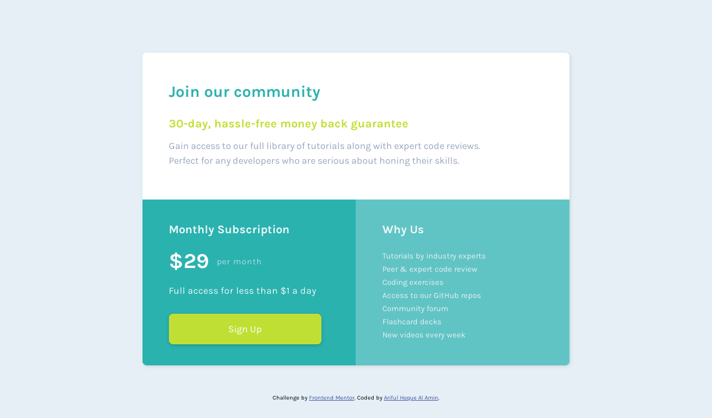

# Frontend Mentor - Single price grid component solution

This is a solution to the [Single price grid component challenge on Frontend Mentor](https://www.frontendmentor.io/challenges/single-price-grid-component-5ce41129d0ff452fec5abbbc). Frontend Mentor challenges help you improve your coding skills by building realistic projects.

The designs were created to the following widths:

- Mobile: 375px
- Desktop: 1440px

## Table of contents

- [Overview](#overview)
  - [The challenge](#the-challenge)
  - [Screenshot](#screenshot)
  - [Links](#links)
- [Author](#author)

## Overview

### The challenge

Users should be able to:

- View the optimal layout for the component depending on their device's screen size
- See a hover state on desktop for the Sign Up call-to-action

### Screenshot

### Links

- Solution URL: https://github.com/Ar1f007/fmentor-single-price-grid-component
- Live Site URL: https://single-price-grid-component-ar1f007.vercel.app/

## Author

- Frontend Mentor - [@Ar1f007](https://www.frontendmentor.io/profile/Ar1f007)
- Twitter - [@Ar1f007](https://twitter.com/Ariif_007)
- Instagram - [@\_4r1f](https://www.instagram.com/_4r1f)
